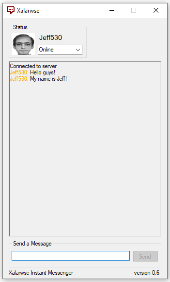

# xalarwse
An instant messenger based around a single group.
Made just for fun. You need WatsonTcp from NuGet to modify the code, but it is included in the executable's folder.

## Client
- Enter your preferred username
- Select an Avatar picture
- Enter Host's IP address into the field
- Enter Host's port into the the field (Only if it is different from the default)
- Click Login

## Server
***NOTE: Not yet publicly available.***
**Defaults: IP: 0.0.0.0 (accessible via your external IPV4 address or your local IPV4 address) Port: 8910**
*You must forward the port to your computer's LAN network IP from your router settings.*

- (Optional) Change the IP/Port to whatever you desire
- Click the Start button to establish the server

## To-Do
- ~~Make it actually work as a group chat~~ ✓
- Add functionality to the 'colors' feature
- Add a menu where you can see all connected users
- Add saving of userdata inbetween uses
- Redo the UI and make it look nice
- Clean up the code and increase security with encryption
